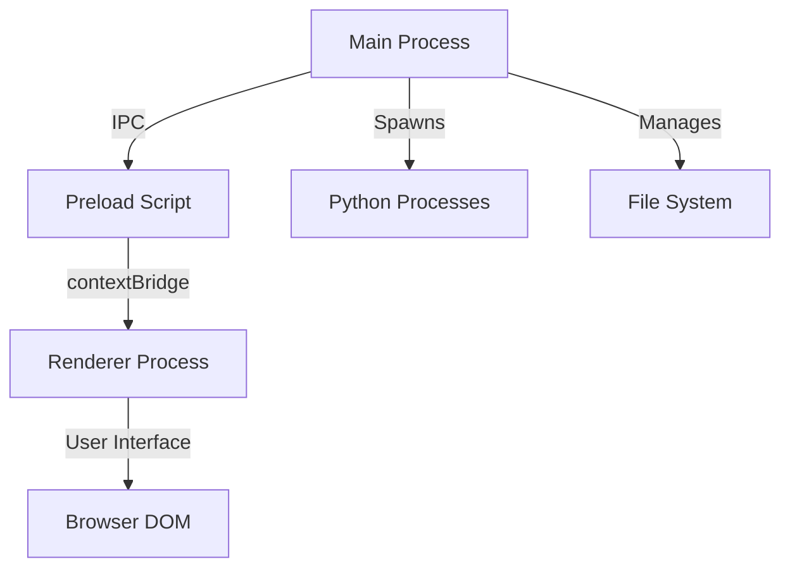
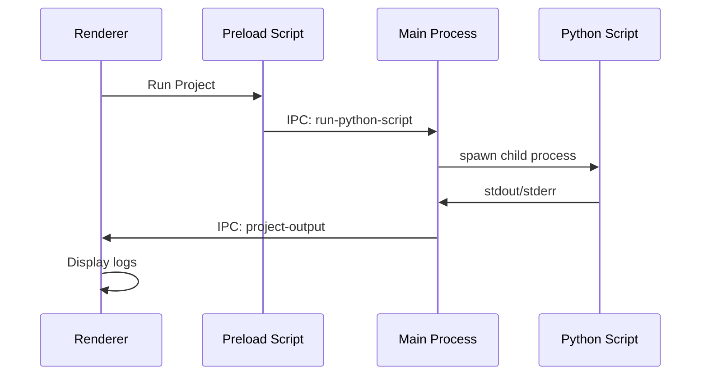

# Release Notes

## Version 0.10.14 - October 2025

### What's New

#### Features
- **Multi-Project Management**: Launch and manage multiple Python projects from a single interface
- **Live Log Streaming**: Real-time output display with intelligent log filtering (info, success, error, stdout, stderr)
- **13 Beautiful Themes**: Choose from Catppuccin, Dracula, Nord, Tokyo Night, and more
- **Admin/User Authentication**: Two-tier access control system for enhanced security
- **Settings Persistence**: All configurations saved automatically using Electron's userData

#### Improvements
- Enhanced UI with custom frameless window design
- Improved settings dialog with tabbed interface
- Better error handling and user feedback with toast notifications
- Optimized theme switching without restart

### Architecture

The application follows Electron's security-first architecture:

### Technical Details

#### Process Communication Flow

### Known Issues
- Native title bar toggle is not yet functional
- Some custom configuration buttons are placeholders

### Coming Soon
- Code editor with syntax highlighting
- Database management interface
- Advanced reporting tools
- Plugin system for extensibility

---

**Project Launcher** - Built with Electron, inspired by Legseq
